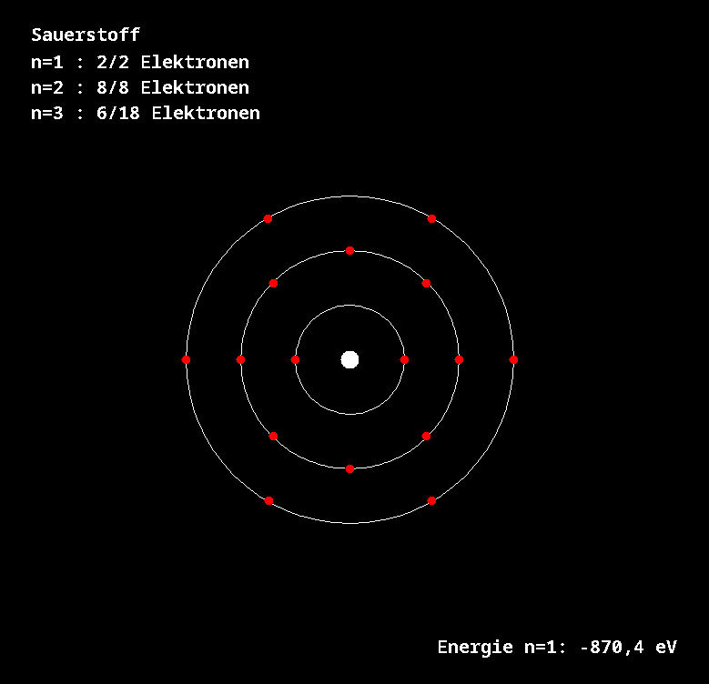

# atom-shells-java

Einfaches Atommodell in Java.

## **Features**
- Grafische Darstellung der Elektronenkonfiguration im Schalenmodell
- Berechnung von Energie in der 1. Schale nach Bohr'schem Atommodell für Wasserstoffähnliche Kerne ( $H$, $He^+$, $Li^{2+}$, $Be^{3+}$, $O^{7+}$ )


## Architektur

```yaml
Main
│ 
├── Atom 
│     ├── Shell[] 
│     ├── calculateConfiguration() 
│     └── calculateEnergy() 
│ 
├── Shell 
│     ├── n 
│     ├── maxElectrons 
│     └── electrons 
│ 
└── AtomPanelRenderer       
    ├── drawAtom()
    └── drawShells()
    
```

## Meilenstein: Grafische Darstellung von Schalen



## Berechnung unter der Haube

```
Sauerstoff (Z = 8) : 
Energie in der ersten Schale : -870,4 eV (O7+)
Verteilung der Elektronen in Sauerstoff (O) : 
n=1 : 2/2 Elektronen
n=2 : 8/8 Elektronen
n=3 : 6/18 Elektronen

Hauptquantenzahl n : aktuelle Elektronen / maximale Elektronen
```

## Siehe auch

- [atom-js](https://github.com/kuranez/atom-js) - Gleiches Projekt in JS 
- [atom-orbitals-java (Orbitalmodell)](https://github.com/kuranez/atom-orbitals-java) - Einfaches Orbitalmodell
