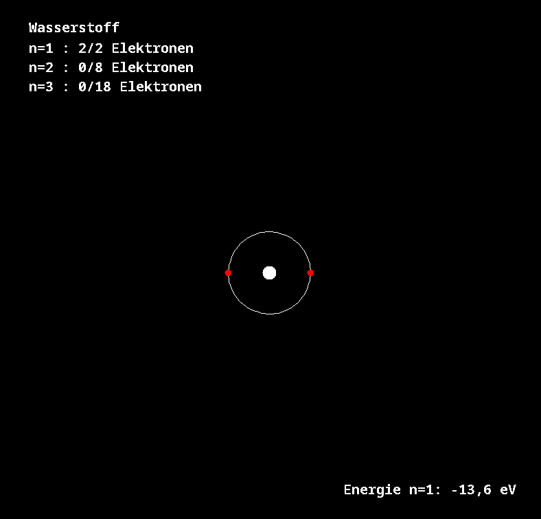
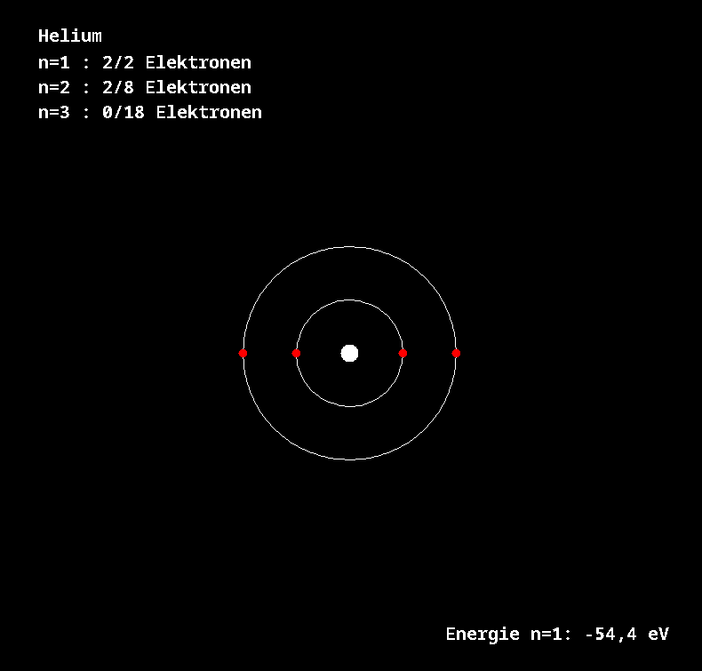
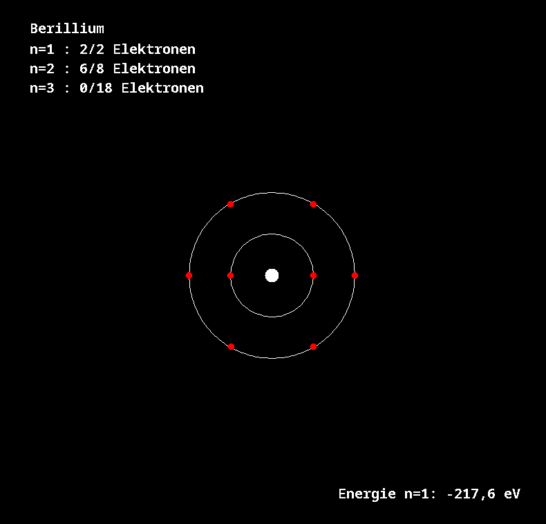
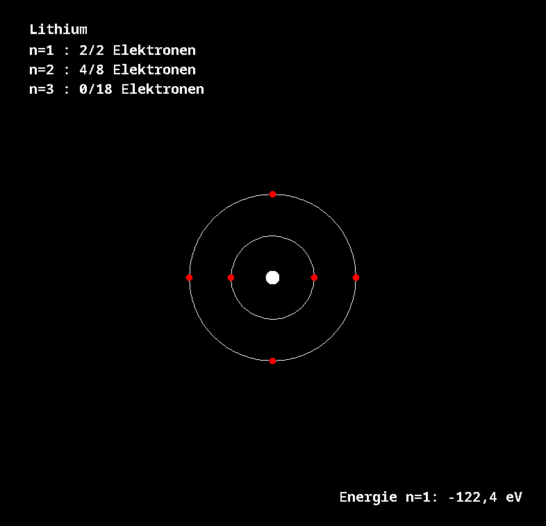

# Schalenmodell - Implementierung in Java

## Ziel der Entwicklung

Das Projekt zeigt die Entwicklung vom einfachen Atommodell bis zur grafischen Darstellung des Bohr'schen Schalenmodells. Die älteren Dateien mit dem Suffix `_old` dokumentieren die Zwischenstände, die aktuellen Dateien zeigen die aufgeräumte und erweiterte Version.

Im aktuellen Stand wurde die Anwendung weiter vereinfacht: `Main.java` startet nur noch ein einzelnes Beispielatom, während die ältere Konsolenversion in `old/Main_old.java` mehrere Atome nacheinander ausgegeben hat.

## Fachliche Grundlage

Am Anfang stehen nur die grundlegenden Eigenschaften eines Atoms:

- Name
- Protonenzahl $Z$
- Elektronenzahl

Darauf aufbauend wird die Energie eines Elektrons in einer Schale berechnet. Für wasserstoffähnliche Kerne gilt im Bohr-Modell:

$$
E_n = -\frac{13.6\,\mathrm{eV} \cdot Z^2}{n^2}
$$

Dabei ist:

- $13.6\,\mathrm{eV}$ die Grundenergie des Wasserstoffs
- $Z$ die Protonenzahl bzw. Kernladung
- $n$ die Hauptquantenzahl der Schale

In Java entspricht das:

```java
return -13.6 * Z * Z / (n * n);
```

## Entwicklung in Versionen und Releases

Die Releases auf GitHub zeigen die fachliche Erweiterung Schritt für Schritt:

### v0.a - Wasserstoffmodell

In diesem frühen Stand ging es nur um Wasserstoff. Die Funktion zur Energieberechnung war noch auf $n$ allein reduziert. 

[Release v0.a](https://github.com/kuranez/atom-java/releases/tag/v0.a)

### v0.b - Wasserstoffähnliche Kerne

Hier wurde das Modell auf wasserstoffähnliche Atome erweitert. Neu waren:

- `name`
- `protonNumber`
- `electronCount`
- `calculateEnergyLevel(Z, n)`

Damit konnte man nicht nur Wasserstoff, sondern auch Helium, Lithium, Beryllium und Sauerstoff als positiv geladene Ionen betrachten.

[Release v0.b](https://github.com/kuranez/atom-java/releases/tag/v0.b)

### v0.c - Schalenmodell

In diesem Schritt kam das eigentliche Schalenmodell dazu. Dafür wurde `Shell.java` eingeführt. Die Klasse kapselt:

- Hauptquantenzahl `n`
- maximale Elektronenzahl `2 * n^2`
- aktuelle Elektronenzahl

`Atom.java` verteilt die Elektronen mit `getConfiguration()` auf mehrere Schalen und gibt sie mit `getConfigurationText()` und `printConfiguration()` aus.

[Release v0.c](https://github.com/kuranez/atom-java/releases/tag/v0.c)

### v0.d - GUI

Der grafische Stand ergänzt die Darstellung des Atoms um eine GUI. Dafür wurde die Klasse `AtomPanelRenderer` eingeführt. Die GUI reduziert außerdem `Main` auf das Erzeugen eines Atoms und das Öffnen eines Fensters.

`Main_old.java` ist eine Konsolenanwendung. Dort werden mehrere Atome nacheinander erzeugt, die Energien ausgegeben und die Elektronenkonfiguration in Textform angezeigt.

`Main.java` ist die aktuelle GUI-Startklasse. Sie erzeugt ein einzelnes Atom, berechnet die Konfiguration und zeigt es im Fenster mit `AtomPanelRenderer` an. Der Fokus liegt damit auf der Visualisierung statt auf der reinen Textausgabe.

[Release v0.d](https://github.com/kuranez/atom-java/releases/tag/v0.d)

### v0.e - Rework des Renderers

In v0.e wurde `AtomPanelRenderer` weiter aufgeteilt und lesbarer gemacht. Der Release beschreibt die Umstrukturierung von `paintComponent()` hin zu kleinen Zeichenmethoden.

Die inhaltliche Änderung gegenüber v0.d ist vor allem organisatorisch:

- `paintComponent()` delegiert nur noch an `drawAtom()`
- die Zeichnung ist in klar getrennte Schritte für Titel, Text, Kern, Schalen und Elektronen aufgeteilt
- Layout-Konstanten wie Mittelpunkt, Kernradius und Schalenabstand sind zentral im Renderer definiert

[Release v0.e](https://github.com/kuranez/atom-shells-java/releases/tag/v0.e)

#### `AtomPanelRenderer_old.java` vs. `AtomPanelRenderer.java`

Die Datei `AtomPanelRenderer_old.java` enthält noch die frühe Monolith-Version der Darstellung. Dort passiert alles direkt in `paintComponent()`:

- Titel zeichnen
- Konfigurationstext zeichnen
- Energietext zeichnen
- Kern zeichnen
- Schalen zeichnen
- Elektronen zeichnen

In der aktuellen `AtomPanelRenderer.java` ist die Darstellung zusätzlich an den tatsächlichen GUI-Stand angepasst. Der Renderer arbeitet mit festen Layout-Konstanten und nutzt den Zustand des aktuellen Atoms direkt aus `Main.java`, das im Moment das Wasserstoff-Beispiel anzeigt.

Die aktuelle `AtomPanelRenderer.java` trennt diese Arbeit in kleine Methoden:

- `drawAtom()`
- `drawNucleus()`
- `drawShells()`
- `drawShell()`
- `drawElectrons()`
- `drawElectron()`
- `drawAtomTitle()`
- `drawConfigurationText()`
- `drawEnergyText()`

Das macht den Code besser lesbar und leichter wartbar, weil jede Aufgabe nur noch an einer Stelle beschrieben ist.

## Screenshots

Die folgenden Beispiele zeigen den aktuellen GUI-Stand des Schalenmodells als Tabelle.

| Atom | Screenshot |
| --- | --- |
| Wasserstoff |  |
| Helium |  |
| Berillium |  |
| Lithium |  |
| Sauerstoff |  |

## Architekturidee

Die Trennung der Verantwortlichkeiten ist bewusst einfach gehalten:

- `Atom.java` enthält Physik und Zustandsdaten
- `Shell.java` kapselt die Eigenschaften einer Schale
- `AtomPanelRenderer.java` ist nur für die grafische Darstellung zuständig
- `Main.java` startet die Anwendung und zeigt das aktuelle Beispielatom

So bleibt das Modell unabhängig von der Darstellung, und die Darstellung wiederum unabhängig von der Konsolenlogik aus den `_old` Dateien.

## Fazit

Aus einem einfachen Atommodell mit Energieberechnung ist schrittweise ein Schalenmodell mit Textausgabe und grafischer Oberfläche entstanden. Die `_old` Dateien zeigen dabei die Zwischenstufen, während die aktuellen Dateien die aufgeteilte und erweiterte Endstruktur abbilden.

---

**Author** : kuranez
